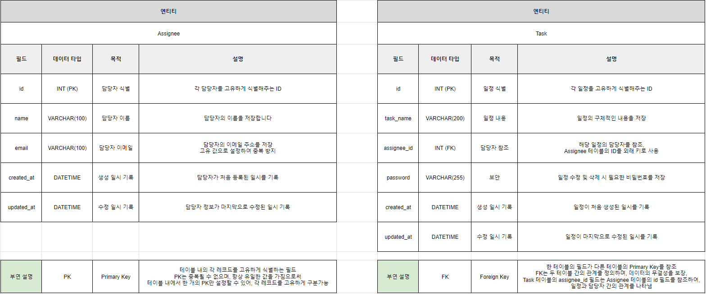
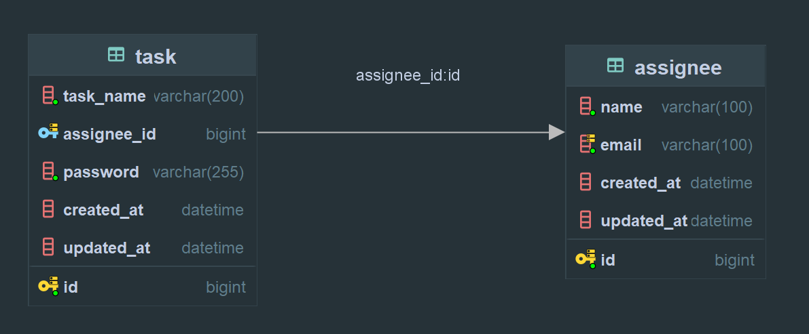
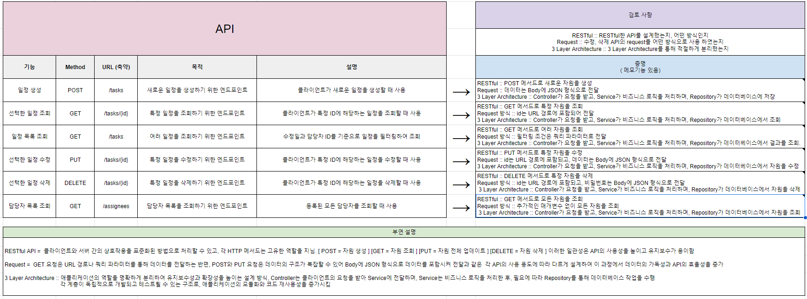
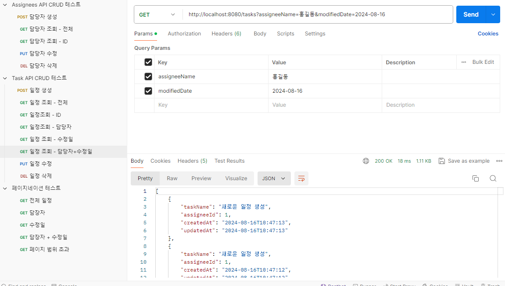

개요
-
일정 관리 애플리케이션의 서버 측 구현이 목표인 프로젝트로 
사용자는 일정을 생성, 조회, 수정, 삭제할 수 있으며, 각각의 일정은 특정 담당자와 연관되어 관리됩니다. 
발제의 요구사항에 맞는 RESTful API를 제공하며,Spring Boot를 기반으로 구현되었습니다. 
데이터베이스는 MySQL을 사용하여 일정 및 담당자 정보를 저장하고 관리합니다.

프로젝트의 주요 목적은 
RESTful API를 통해 일정 관리 기능을 제공하는 서버 애플리케이션의 구축으로 
클라이언트로부터 일정과 관련된 요청을 받아 처리하며, 
요청된 작업을 수행한 후 JSON 형식으로 응답을 반환합니다. 
3 Layer Architecture 구조를 통해 각 레이어(컨트롤러,서비스 , 레포지토리)는 명확하게 구분된 역할을 수행하고 
데이터베이스와의 연동을 위해 JPA를 사용한다면 
JDBC를 간접적으로 처리해 별도의 코드작성이 필요없지만
JDBC Template를 사용해 SQL 쿼리를 직접 작성하고, 
결과를 매핑하는 작업 또한 수작업 하여 기본적인 쿼리 작성과 데이터 관리를 연습합니다. 
또한, 데이터베이스 생성부터 기본적인 데이터 무결성을 보장하고 
@Valid 어노테이션을 활용해 예외 처리와 
입력 데이터의 유효성 검증을 포함하여 안정성과 일관성을 유지하도록 설계되었습니다. 

기술 스택
-
프레임워크 :: Spring Boot 3.3.2 
Spring Boot 3.3.2는 최신 기능과 많은 프로젝트에 사용되어 검증된 성능 최적화가 포함된 안정적인 버전으로, Spring의 다양한 생태계와도 잘 통합되며
RESTful API를 빠르고 쉽게 개발할 수 있게 해줍니다.

웹 모듈 :: Spring Web 
RESTful API와 웹 애플리케이션을 개발하는 데 필요한 필수 기능들을 제공하는 스프링 프레임워크의 모듈로,
컨트롤러, 라우팅, 요청/응답 처리 등을 쉽게 구현할 수 있으며, HTTP 요청 처리와 관련된 다양한 기능을 지원합니다.

언어 :: Java (JDK 17) 
JDK 17은 장기 지원(LTS)을 제공하는 안정된 버전으로, 많은 프로젝트에서 사용되어 검증된 성능과 안정성이 뛰어나며 Spring Boot 3.3.2와 호환됩니다.

빌드 :: Gradle 
프로젝트 의존성 관리와 빌드 속도 최적화에 강점가져 Spring Boot 프로젝트에서 자주 사용되며, 다양한 플러그인과의 통합 또한 유리합니다.

데이터베이스 :: MySQL 8.0.33 
많은 개발 환경에서 널리 사용되는 오픈 소스 관계형 데이터베이스 시스템으로,
검증된 성능과 안정성이 뛰어나며 프로젝트에서 데이터 무결성과 관계형 데이터베이스의 특성 활용을 연습하기에 좋습니다.

데이터베이스 접근 :: JDBC Template 
JDBC Template은 Spring Framework에서 제공하는 클래스로, SQL 쿼리를 직접 작성하고 결과를 매핑하는 작업을 수작업으로 처리할 수 있게 해줍니다.
별도의 코드 작성이 필요없는 JPA를 사용했을 때 보다는 불편하지만 이를 통해 기본적인 SQL 쿼리 작성과 데이터 관리를 직접 연습하며 데이터베이스와의 직접적인 상호작용을 경험할 수 있습니다.

편의성 의존성 :: Lombok 
다양한 어노테이션을 통해 코드를 자동으로 생성함으로써 반복되는 코드를 줄이고 가독성을 높여 개발 생산성을 증가시켜줍니다.

API 테스트 :: Postman 
RESTful API의 테스트 및 디버깅 도구로, 클라이언트가 보낼 요청을 쉽게 구성하고 응답을 검증할 수 있습니다. API가 요구사항에 맞게 동작하는지 확인하기 위해 사용합니다.

그외 JPA 전체를 사용하지는 않고, 
@Entity나 @Id 같은 일부 JPA 어노테이션을 데이터베이스와 매핑을 위해 사용되었습니다. 
위에 문장으로는 설명이 약간 부족했어서 몇몇분들이 질문 해주셨는대 
@Column 같은 어노테이션은 jdbc에서 필요없고 ORM방식이 아니라 직접 쿼리로 매핑해서 
사용되지 않는 어노테이션들은 어차피 런타임에서 참조되지않으면 무시되버려 에러도없고 
미리 JPA 연습삼아 작성한거라 크게 신경 안쓰셔도 됩니다! 
연습용 및 가독성용이라고 생각해주시면 될거같습니다. 

개발 시작전 작성한 문서는 구글 시트를 참고해 주시고, 
사용한 상세 API명세서는 apidocs에 .http파일을 참고 부탁드립니다.

구글 시트 링크 : https://docs.google.com/spreadsheets/d/16yc4ySLqkufsZgRZl24PteVnoyDYsf4KLK8aOvjDpNs/edit?usp=sharing

